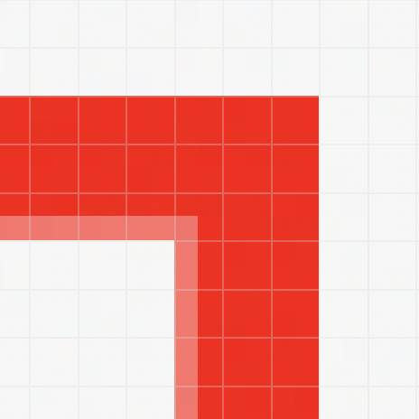
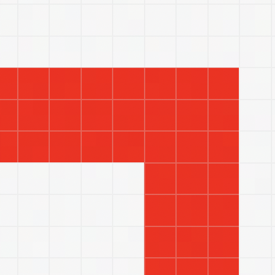

For the following code:

```swift
// borderLayer1 renders the border in 3 points wide
// ⚠️ but the outer 2.5 points are solid red, and inner 0.5 points are rendered in semi transparent red
let borderLayer1 = CALayer()
borderLayer1.cornerCurve = .continuous
borderLayer1.borderColor = NSColor.red.cgColor
borderLayer1.borderWidth = 3

borderLayer1.frame = CGRect(x: 100, y: 100, width: 50, height: 50)

view.layer?.addSublayer(borderLayer1)

// borderLayer2 renders the border perfectly
let borderLayer2 = CALayer()
borderLayer2.cornerCurve = .circular
borderLayer2.borderColor = NSColor.red.cgColor
borderLayer2.borderWidth = 3

borderLayer2.frame = CGRect(x: 200, y: 100, width: 50, height: 50)
view.layer?.addSublayer(borderLayer2)
```

There's a border render issue on macOS (tested on macOS Monterey, 12.5.1).

with `CALayer.cornerCurve = .continuous`, on macOS, the layer's border's inner 1 pixel is rendered incorrectly, see the following screenshots:

| border 1 | border 2 |
| :-: | :-: |
|  |  | 

on iOS (iOS 15/16), both layers' borders are rendered perfectly.
